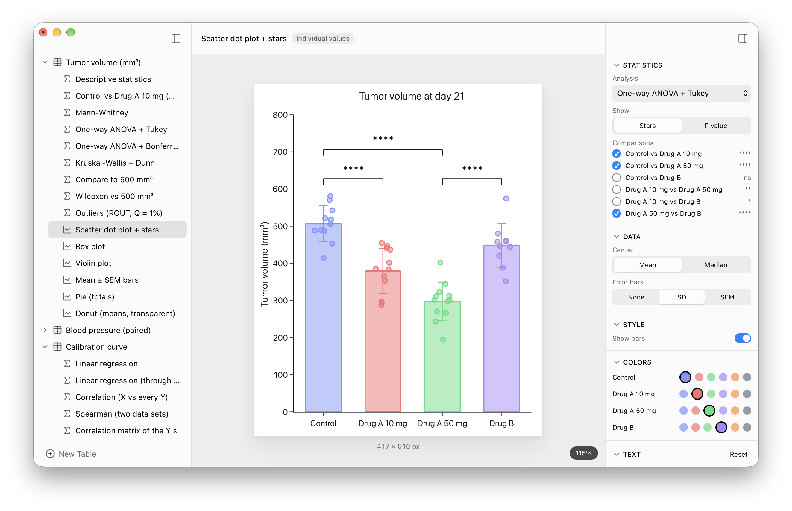

# Helix

**Scientific data analysis, simplified.**

Organize, analyze and visualize scientific data, from raw numbers to publication-ready
graphs. Helix is a free, open-source and private alternative to GraphPad Prism for macOS.

Three engines do the work: a fast data grid built for Helix, **R**, the reference for
statistics (through [webR](https://github.com/r-wasm/webr), R compiled to WebAssembly), and
**[Plotly](https://plotly.com/javascript/)** for the graphs. Everything runs on your Mac.



## Download

Get the latest version from the [Releases page](https://github.com/mickaphd/Helix/releases/latest):

- `Helix_…_aarch64.dmg` for Macs with Apple Silicon (M1 and later)
- `Helix_…_x64.dmg` for Macs with an Intel processor

Requires macOS 13 (Ventura) or later.

> [!IMPORTANT]
> **Helix isn't signed by Apple yet**, so macOS blocks it the first time you open it. Nothing is wrong:
> it only takes one click in System Settings, [explained just below](#first-launch-why-macos-asks-and-what-to-do).

### First launch: why macOS asks, and what to do

**Why.** Apple charges developers $99 a year to sign their apps. Helix is free and made by
one person, so it isn't signed yet. macOS therefore can't check who made it and blocks it the
first time, as it does for any unsigned app. That's not a sign of a problem: Helix's code is
all here, open for anyone to read.

**What to do** (once, the first time):

1. Open the DMG and drag **Helix** into the **Applications** folder.
2. Open Helix. macOS says *“Helix.app” Not Opened*: click **Done** (not *Move to Trash*).
3. Open **System Settings › Privacy & Security** and scroll down to **Security**. Next to
   *“Helix.app” was blocked to protect your Mac*, click **Open Anyway**, then confirm with
   Touch ID or your password.
4. macOS asks one last time, *Open “Helix.app”?*: click **Open Anyway**.

From then on, Helix opens normally. When a new version is out, Helix tells you (Helix › Check
for Updates…): download it, replace the old one, and do these steps once more.

## What Helix does

Helix is built on three pillars: each **table** holds its own **analyses** and **graphs**,
which update as soon as the data change.

### Tables

- Five table types: **Column**, **XY**, **Grouped**, **Multiple Variables** and **Contingency**
- A spreadsheet that feels like one: copy and paste with Excel or Numbers, fill down, find,
  undo and redo everything
- Exclude a value from the analyses without deleting it; color a whole series or a single point

### Analyses

Guided assistants ask the right questions and pick the right test, and can check normality
for you. Every result comes from R.

- **Descriptive statistics** and **outlier detection** (ROUT)
- **Two groups:** unpaired, Welch, paired and ratio t tests, Mann-Whitney, Wilcoxon
- **More groups:** one-way and repeated-measures ANOVA, Kruskal-Wallis, Friedman, with multiple
  comparisons (Tukey, Bonferroni, Dunn)
- **Grouped data:** two-way ANOVA (ordinary, repeated measures, Scheirer-Ray-Hare) and
  multiple t tests with Holm or FDR correction
- **XY and variables:** correlation (Pearson, Spearman), linear and nonlinear regression
  (dose-response, 4PL), multiple regression, area under the curve
- **Contingency:** chi-square and Fisher's exact test

### Graphs

- The right graphs for each table: individual values, box and violin plots, bars, lines,
  scatter plots, dose-response curves, Kaplan-Meier survival curves, heatmaps, pie charts, and
  volcano plots that handle tens of thousands of genes
- Significance stars and regression lines drawn straight from your analyses
- Figures ready for a paper: resize by dragging an axis, set exact sizes, pick colors, white or
  transparent background; export as PNG (300 dpi), SVG or JPG, or copy and paste anywhere

### Projects

- A native Mac app: real menus and shortcuts, light and dark mode, resizable sidebar and inspector
- Open projects: a Helix file (`.hlx`) is plain JSON, described in [FILE-FORMAT.md](FILE-FORMAT.md),
  so your data are never locked in

**Try it:** Help › Sample Project opens a project with several kinds of tables, analyses, and graphs that Helix offers ([also here](samples/Helix%20Sample.hlx)).

## Privacy

Helix works entirely on your Mac: your data never leaves it, and there is no telemetry in the app. Its only connection is a daily check on GitHub for a newer version.

## Building from source

You need [Node.js](https://nodejs.org) 24 or later, [Rust](https://rustup.rs), and the
Xcode Command Line Tools (`xcode-select --install`).

```bash
npm ci            # install
npm run dev       # run Helix with live reload
npm test          # check every analysis and graph against R
npm run build     # build the two DMGs
```

## License

Helix is free software: you can redistribute it and modify it under the terms of the
[GNU General Public License](LICENSE), version 3 or later. It comes with no warranty.

© 2026 mickaphd · [helix-desktop.com](https://www.helix-desktop.com)

## Acknowledgments

Helix stands on the shoulders of [R](https://www.r-project.org) and
[webR](https://github.com/r-wasm/webr), which bring R to the app,
[Plotly.js](https://plotly.com/javascript/) for the graphs, and [Tauri](https://tauri.app)
and [React](https://react.dev) for the app itself. See
[THIRD-PARTY-NOTICES.md](THIRD-PARTY-NOTICES.md) for all of them and their licenses.

GraphPad Prism is a trademark of GraphPad Software, LLC. Helix is an independent project,
not affiliated with or endorsed by GraphPad Software.
